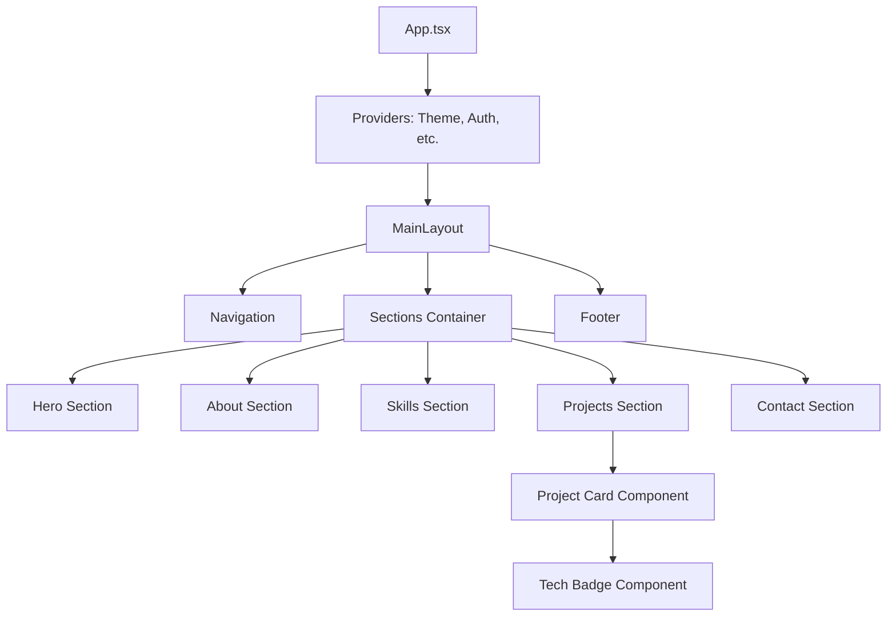

# Architecture & User Flow 🏗️

Tài liệu này chi tiết hóa cấu trúc kỹ thuật và các luồng tương tác chính của trang Portfolio.

## 1. Kiến Trúc Hệ Thống (Technical Architecture)

Dự án được xây dựng dựa trên kiến trúc Component-based của React, kết hợp với các library hiện đại để tối ưu hiệu suất và trải nghiệm.

### 1.1 Sơ đồ Cấu trúc (Component Hierarchy)


### 1.2 Công nghệ & Công cụ (Tech Stack Detail)
- **Frontend Framework**: React 18+ (Vite) - Ưu điểm: Fast Refresh, Bundle nhỏ.
- **Styling**: Tailwind CSS - Ưu điểm: Utility-first, dễ dàng tùy chỉnh UI cực nhanh.
- **Animation**: Framer Motion - Ưu điểm: Hiệu ứng mượt mà (scroll, hover, transition).
- **State Management**: React Hooks (useState, useEffect, useContext) - Đủ dùng cho portfolio đơn giản.
- **Deployment**: Vercel hoặc Netlify - Ưu điểm: Auto-deploy từ GitHub, hỗ trợ SSL miễn phí.

---

## 2. Luồng Người Dùng (User Flow)

Chúng ta tối ưu luồng chuyển động dựa trên hai nhóm đối tượng chính (HR và Client).

### 2.1 Luồng Khám Phá (Exploration Flow)
1. **Tiếp cận**: User vào `index.html`.
2. **First Glance (Hero)**: Thấy rõ tên, vai trò và 2 nút CTA: "Xem dự án" và "Tải CV".
3. **Scroll & Reveal**: Khi user cuộn xuống, các section `About` và `Skills` lần lượt xuất hiện với hiệu ứng mượt mà.
4. **Interaction (Projects)**: User hover vào các thẻ dự án để xem demo nhanh hoặc tech stack sử dụng.
5. **Validation**: Click vào "Link GitHub" hoặc "Live Demo" để kiểm tra tính xác thực.

### 2.2 Luồng Chuyển Đổi (Conversion Flow)
- **Flow A (HR)**: `Hero` -> `Download CV (PDF)` -> (Lưu thông tin ứng viên).
- **Flow B (Client)**: `Hero` -> `Projects` -> `Contact Form` -> `Send Message` -> (NHẬN EMAIL THÔNG BÁO).

---

## 3. Quản Lý Dữ Liệu (Data Management)

Mọi dữ liệu về dự án và kỹ năng sẽ được quản lý tập trung để dễ dàng cập nhật mà không cần can thiệp quá sâu vào UI code.

- **File**: `src/app/data/portfolio.json` (hoặc `.ts`)
- **Cấu trúc dữ liệu dự án mẫu**:
```json
{
  "id": "project-1",
  "title": "E-commerce Dashboard",
  "description": "Giải pháp quản lý kho cho các shop nhỏ...",
  "techStack": ["React", "TypeScript", "Node.js"],
  "link": "https://github.com/...",
  "image": "/assets/project1.png"
}
```

---

## 4. Kế Hoạch Hiện Thực Hóa (Next Steps)
1. **Setup Data Layer**: Chuyển các thông tin cứng trong code sang file data tập trung.
2. **Thiết kế lại Hero Section**: Dùng Framer Motion để tạo hiệu ứng ấn tượng ngay từ đầu.
3. **Optimize Navigation**: Thêm hiệu ứng cuộn mượt (Smooth Scroll) và Scroll Spy (highlight menu khi cuộn).
